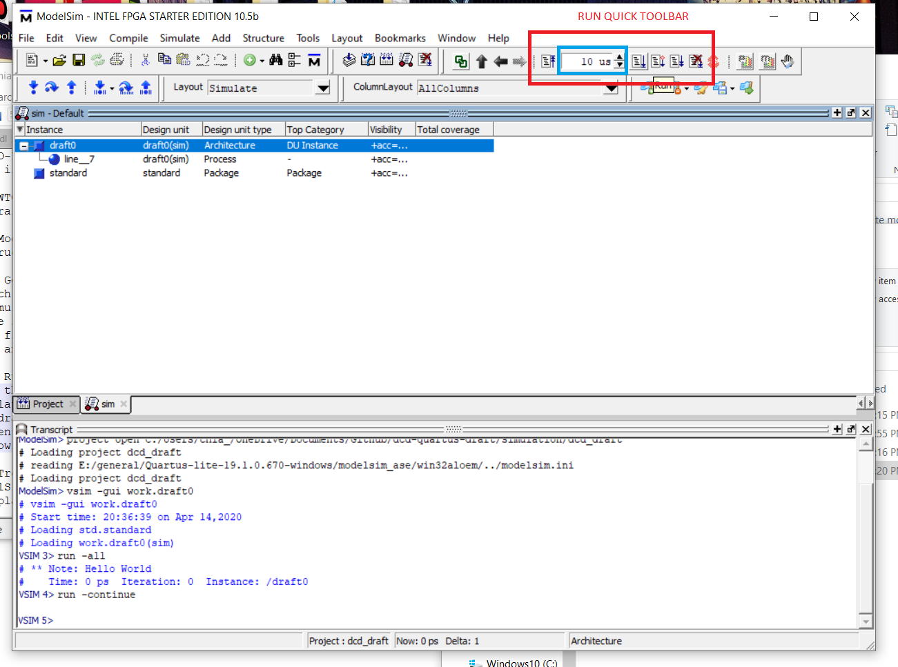
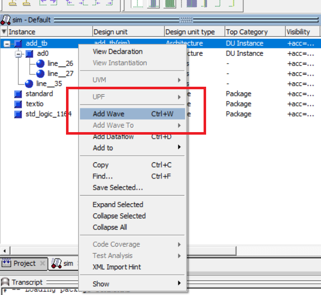
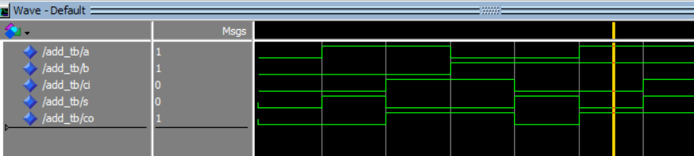

# DCD-DRAFT
This is a draft repository for my Digital Computer Design class ECE4116. I believe best way to learn such thing is to DO IT WHILE I LEARN IT, otherwise known as DIWIL. Hence, this repository is created for use (as both a scratchpad and a template for further projects).

## HOWTO
General instructions for the lost sheeps. Where to download ? [We are using Quartus Lite Edition](https://fpgasoftware.intel.com/?edition=lite) which is free (sweet). 

### ModelSim
Instructions on ModelSim (This is the simulation tool used along with Quartus)

#### Getting started
Launch modelsim, then go to `File->Open` and select the `dcd_draft.mpf` file under the `/simulation` directory. One may add more testbench files (.vhdl) to modelsim by right clicking a white space then `AddtoProject` or go the the `Project->AddtoProject` menu. Select the relevant VHDL file from there (ensure reference from current location is used). To compile, click on a file and right click, a menu drops and one may compile.

#### Running
Once the vhdl files are compiled, go to the `Simulate` menu, drop down and select `Start Simulation`. You may select which entity we want to simulate. For instance, the 4 testbench files are draft0-3 which can be selected. Where are they? Under the `work` library as that stores the current working files. Select from menu `Simulate->Run->*` to run or alternatively, refer to the following image. The Red section allows control of the simulation runs and the blue section allows control of each 'Run' length.

Once you are able to run some simple testbenches. move on to the `add_tb` which showcases a simple full adder implementation and testbench. The Fulladder1bit component is defined [here](vhdl/component/Fulladder1bit.vhdl). To simulate and view wave form, right click on `add_tb` from the simulation panel following by clicking on `Add Wave` as shown in the picture below.

You may now view the waveforms in the window. Scroll the yellow vert. line to examine bits values. Pressing `i` or `o` zooms in or out, or you may right click on the wave diagram for more options.

### Troubleshooting
ModelSim doesn't show compilation output? right click on empty space `Project Settings` and tick `Display Compiler Output`

## TODOs (How to help this improve this draft project)
	2. How to use Quartus? We only know how to use ModelSim for now
	3. Sample Adder Circuit simulation (4-bit ripple carry) for syntax referencing (untested)
	4. For 3, full adders should be a separate package/vhdl file to allow modularity.

### References
[Basis tutorial from vhdlwhiz.com](https://vhdlwhiz.com/)

### Contact
Any ideas? [contact me](mailto:chia_jason96@live.com)